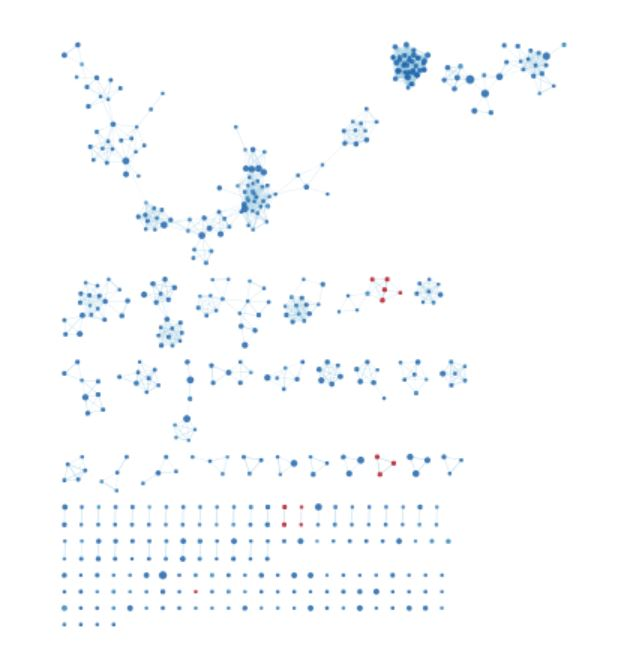
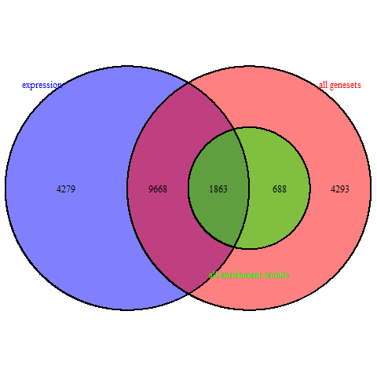

## Chapter 1: Dataset Cleanup and Normalization

```{r chap1, child='expr_cleanup.Rmd'}

```

## Chapter 2: Differential Gene expression and Preliminary ORA

```{r chap2, child='A2_DinaIssakova.Rmd'}

```

## Chapter 3: Data set Pathway and Network Analysis

```{r installs, message=FALSE, echo=FALSE, warning=FALSE}

if (!require(RCurl)){
  install.packages("RCurl")
}
if (!require(GSA)){
  install.packages("GSA")
}
if (!require(VennDiagram)){
  install.packages("VennDiagram")
}
if (!require(ComplexHeatmap)){
  BiocManager::install("ComplexHeatmap")
}
if (!require(circlize)){
  BiocManager::install("circlize")
}
if (!require(Biobase)){
  BiocManager::install("Biobase")
}
if (!require(knitr)){
  install.packages("knitr")
}
library(knitr)
library(Biobase)
library(RCurl)
library(GSA)
library(VennDiagram)
library(ComplexHeatmap)
library(circlize)

```

# Introduction

In the previous assignments, we had sourced, cleaned, and normalized dataset GSE77938. 

This dataset explores the factors contributing to keratoconus (KTCN). Keratoconus is a disorder of the eye that results in progressive thinning of the cornea, which may result in blurry vision, double vision, nearsightedness, astigmatism, and light sensitivity. This study performed comprehensive transcriptome profiling of human KTCN corneas using an RNA-Seq approach, the discovery analysis comparing eight KTCN (test condition) and eight non-KTCN (control) corneas [@ktcn].

Here, we aim to determine pathways associated with significantly up- and down-reguated genes in KTCN corneas. First, we normalized the data. Then, we determined pathways associated with significantly up- and down-regulated genes in KTCN corneas by differential expression analysis. 

With our significantly up-regulated and down-regulated set of genes, we ran a thresholded gene set enrichment analysis. This dataset has 2562 upregulated genes, and 2092 downregulated genes. Now, we can run non-thresholded pathway analysis, compare those results to our thresholded pathway analysis, and analyse the pathways associated with this geneset, as well as dark matter present in this dataset. 

# Non-thresholded pathway analysis

Non-thresholded pathway analysis was run using GSEA version 4.0.3 [@gsea]. An analysis was run on a pre-ranked gene list with a maximum pathway size of 200 and a minimum pathway size of 15. 

The geneset used was obtained from the Bader Lab website, and contained all human pathways without GO information. The version pulled was that current to April 1, 2020. 
We download it below. 

```{r download_gmt, message=FALSE}
gmt_url = "http://download.baderlab.org/EM_Genesets/current_release/Human/symbol/"
# list all the files on the server
filenames = getURL(gmt_url)
tc = textConnection(filenames)
contents = readLines(tc)
close(tc)
# get the gmt that has all the pathways and does not include terms inferred from
# electronic annotations(IEA) start with gmt file that has pathways only
rx = gregexpr("(?<=<a href=\")(.*.GOBP_AllPathways_no_GO_iea.*.)(.gmt)(?=\">)", contents, 
    perl = TRUE)
gmt_file = unlist(regmatches(contents, rx))
dest_gmt_file <- file.path(gmt_file)
download.file(paste(gmt_url, gmt_file, sep = ""), destfile = dest_gmt_file)
```

To get the pre-ranked gene list for GSEA, we use our enrichment scores from Assignment 2, and convert that to a .rnk file. 

```{r}
en_data <- output_hits_withgn
en_data <- en_data[,c(1,8)]

write.table(en_data,file="expression_rank.rnk",quote=F,sep="\t",row.names=F)

head(en_data)

```

We then ran the analysis with GSEA. 

The top pathways upregulated in KTCN were, summarised:

* regulation of gene expression
* RNA Polymerase I related pathways
* mRNA transport
* Mitochondrial RNA processing
* Activation of RNA expression

Using thresholded analysis, we had found that the main up-regulated factors are ETF, SP4, and other transcription factors: overall, what we see is an upregulation in DNA binding transcription factor actiity. This was consistent with the publication, which also specifically mentions upregulation of CREB phosphorylation through the activation of Ras. 

This is consistent with the results from the non-thresholded pathway analysis: most or all of the top pathways are associated with RNA Polymerase I, the main transcription enzyme, or RNA processing of some form, which obviously are all processes tightly related to the transcription process. Combining these two analyses, we can more confidently say that KTCN patients have an upregulation of transcription-related processes. 

The top pathways downregulated in KTCN were, summarised: 

* Epithelial mesenchymal transition
* translational silencing
* GTP hydrolysis
* Eukaryotic translation

In the thresholded analysis, we had stated that the main down-regulated pathways are adherens-junction related: "anchoring junction", "adherens junction", "extracellular matrix organization" etc. This is supported in the paper as well, as extracellular matrix organization was for the authors also a main down-regulated pathway.
Here, we see more of a focus on the downregulation of translation-related mechanisms. This was not noted in the original paper [@ktcn]. 

# EnrichmentMap Analysis

Using the results from the non-thresholded gene set enrichment analysis, the results were visualized in Cytoscape [@cytoscape] using EnrichmentMap[@em]. The resulting map was generated using an FDR cutoff of 0.05. 

The resulting network was very, very large and hard to summarise or interpret. This is a screenshot of the network before summary or manual layout. 



Due to the very large number of nodes, a reasonable understanding of the pathways up- and down- regulated in KTCN could only be obtained by excluding smaller clusters (bottom 20%) and thematically summarising clusters. Annotation was done using AutoAnnotate, with default parameters. 


One of the main themes is cardiac development morphogenesis, along with themes relating to actin filament bundle upregulation and the upregulation of the bmp pathway. The actin dysregulation is consistent with the original paper, which noted the disruption of multiple pathways relating to the cytoskeleton and adherens junctions. It is surprising, however, to see such an upregulation of genes relating to cardiac morphogenesis, given that KTCN is a corneal disease. However, the disruption of adherens junctions would also, in other cells, lead to effects on cell morphogenesis. It is likely that the cardiac pathways are very well-annotated due to their medical importance, and that this dominant theme expands upon the original finding of the adherens junction disruption. This is also supported by findings in the literature. [@cardiac] Specifically, a commonality between both themes are intercalated disks (ICDs), which are highly organized cell-cell adhesion structures and connect cardiomyocytes to one another. Furthermore, studies have shown that adherens junctions organize independently of gap junctions and other ICD components, which makes it more likely that this is a true hit and that issues in adherens junctions can influence the heart[@ICD] Human genetics and mouse models have revealed that mutations and/or deficiencies in various ICD components can lead to cardiomyopathies and arrhythmias. As such, this analysis provides the interesting development that this weakness in adherens junctions might cause issues elsewhere in the body as well, and that this is a topic that should be investigated. 


# Dark Matter analysis

Dark matter genes are genes that are significantly differentially expressed in the model, but not annotated to any pathways. We want to analyse these genes in our dataset. The original paper for this dataset focuses on the disruption of three pathways relating to the adherens junction. By focusing on dark matter genes, we might discover other, less noticed impacts of KTCN. 

We follow the following steps: 

1. Download definitions of genesets used in analysis: gmt file. 

```{r}
library(GSA)
gmt_file <- file.path("Human_GOBP_AllPathways_no_GO_iea_April_01_2020_symbol.gmt")
capture.output(genesets<- GSA.read.gmt(gmt_file),file="gsa_load.out")
names(genesets$genesets) <- genesets$geneset.names
```

2. Define our expression and rank files. 

```{r}
expression <- rownames(expressionMatrix)
ranks <- read.table(file.path(getwd(), "expression.rnk"), 
                    header = TRUE, sep = "\t", quote="\"",  
                    stringsAsFactors = FALSE)
```

3. Access our GSEA directories. 

```{r}
#get all the GSEA directories
gsea_directories <- list.files(path = file.path(getwd(),"gsea"), 
                                 pattern = "\\.GseaPreranked")
if(length(gsea_directories) == 1){
  gsea_dir <- file.path(getwd(),"gsea",gsea_directories[1])
  #get the gsea result files
  gsea_results_files <- list.files(path = gsea_dir, 
                                 pattern = "gsea_report_*.*.xls")
  #there should be 2 gsea results files
  enr_file1 <- read.table(file.path(gsea_dir,gsea_results_files[1]), 
                        header = TRUE, sep = "\t", quote="\"",  
                        stringsAsFactors = FALSE,row.names=1)
  enr_file2 <- read.table(file.path(gsea_dir,gsea_results_files[1]), 
                        header = TRUE, sep = "\t", quote="\"",  
                        stringsAsFactors = FALSE,row.names=1)
}
```

Collect the Data we need to calculate the dark matter from the above files:

1. all genes in the expression set - already loaded above
2. all genes in the enrichment results
3. all genes in the significant enrichment results - define your thresholds

```{r}
FDR_threshold <- 0.001
#get the genes from the set of enriched pathways (no matter what threshold)
all_sig_enr_genesets<- c(rownames(enr_file1)[which(enr_file1[,"FDR.q.val"]<=FDR_threshold)], rownames(enr_file2)[which(enr_file2[,"FDR.q.val"]<=FDR_threshold)])
genes_sig_enr_gs <- c()
for(i in 1:length(all_sig_enr_genesets)){
  current_geneset <- unlist(genesets$genesets[which(genesets$geneset.names %in% all_sig_enr_genesets[i])]) 
  genes_sig_enr_gs <- union(genes_sig_enr_gs, current_geneset)
}
```

4. Obtain the list of all genes in our geneset file. 

```{r}
genes_all_gs <- unique(unlist(genesets$genesets))
```



We can see that there is a large region of overlap between the genes that are differentially expressed, and those genes that are not enriched in our model. 

We look at some of the top ranked dark matter genes. 

```{r}
genes_no_annotation <- setdiff(expression, genes_all_gs)
ranked_gene_no_annotation <- ranks[which(ranks[,1] %in% genes_no_annotation),]
ranked_gene_no_annotation[1:10,]
```

The highest-scoring gene is SLFN12, associated with Syndromic X-Linked Intellectual Disability Turner Type, which may indicate a potential connection. Many of the other genes on this list, however, have uncertainties in their sequences, or cautions regarding their initiation or transcription. It is likely for this reason that they are not enriched in particular pathways, as they simply haven't been annotated. 

We can look at a heatmap of any significant genes that are not annotated to any pathways in entire set of pathways used for the analysis.

```{r}
top_hits <- output_hits[which(output_hits$x%in%ranked_gene_no_annotation$x),]$x[1:100]

heatmap_matrix <- normalized_counts
rownames(heatmap_matrix) <- rownames(normalized_counts)
colnames(heatmap_matrix) <- colnames(normalized_counts)

heatmap_matrix <- t(scale(t(heatmap_matrix)))

heatmap_matrix_tophits <- t(
  scale(t(heatmap_matrix[which(rownames(heatmap_matrix) %in% top_hits),])))
if(min(heatmap_matrix_tophits) == 0){
    heatmap_col = colorRamp2(c( 0, max(heatmap_matrix_tophits)), 
                             c( "white", "red"))
  } else {
    heatmap_col = colorRamp2(c(min(heatmap_matrix_tophits), 0, max(heatmap_matrix_tophits)), c("blue", "white", "red"))
  }
current_heatmap <- Heatmap(as.matrix(heatmap_matrix_tophits),
                           name = "DE",
                           cluster_rows = TRUE,
                           cluster_columns = TRUE,
                               show_row_dend = TRUE,
                               show_column_dend = TRUE, 
                               col=heatmap_col,
                               show_column_names = TRUE, 
                               show_row_names = FALSE,
                               show_heatmap_legend = TRUE,
                               
                               )

current_heatmap
```

Compare this to a heatmap of the genes that are not annotated to any of the pathways returned in the enrichment analysis, but might be annotated to SOME pathway: 

```{r}
genes_no_annotation <- setdiff(expression, genes_sig_enr_gs)
ranked_gene_no_annotation <- ranks[which(ranks[,1] %in% genes_no_annotation),]


top_hits <- output_hits[which(output_hits$x%in%ranked_gene_no_annotation$x),]$x[1:100]

heatmap_matrix <- normalized_counts
rownames(heatmap_matrix) <- rownames(normalized_counts)
colnames(heatmap_matrix) <- colnames(normalized_counts)

heatmap_matrix <- t(scale(t(heatmap_matrix)))

heatmap_matrix_tophits <- t(
  scale(t(heatmap_matrix[which(rownames(heatmap_matrix) %in% top_hits),])))
if(min(heatmap_matrix_tophits) == 0){
    heatmap_col = colorRamp2(c( 0, max(heatmap_matrix_tophits)), 
                             c( "white", "red"))
  } else {
    heatmap_col = colorRamp2(c(min(heatmap_matrix_tophits), 0, max(heatmap_matrix_tophits)), c("blue", "white", "red"))
  }
current_heatmap <- Heatmap(as.matrix(heatmap_matrix_tophits),
                           name = "DE",
                           cluster_rows = TRUE,
                           cluster_columns = TRUE,
                               show_row_dend = TRUE,
                               show_column_dend = TRUE, 
                               col=heatmap_col,
                               show_column_names = TRUE, 
                               show_row_names = FALSE,
                               show_heatmap_legend = TRUE,
                               
                               )

current_heatmap
```

As we can see, both heatmaps are very similar. It is thus likely that this dark matter is due to an annotation issue, and not genes present in pathways that are not shown as enriched. 

## References

Packages used: 

[limma](https://bioconductor.org/packages/release/bioc/html/limma.html)
[Biobase](https://www.bioconductor.org/packages/release/bioc/html/Biobase.html)
[ComplexHeatmap](https://bioconductor.org/packages/release/bioc/html/ComplexHeatmap.html)
[circlize](https://cran.r-project.org/web/packages/circlize/index.html)
[knitr](https://yihui.org/knitr/)
[VennDiagram](https://cran.r-project.org/web/packages/VennDiagram/VennDiagram.pdf)
[GSA](https://cran.r-project.org/web/packages/GSA/index.html)


